p8105\_hw6\_mfc2162
================
Madeline Cannon
11/17/2019

``` r
library(tidyverse)
```

    ## -- Attaching packages ------------------------------------------------- tidyverse 1.2.1 --

    ## v ggplot2 3.2.0     v purrr   0.3.2
    ## v tibble  2.1.3     v dplyr   0.8.3
    ## v tidyr   1.0.0     v stringr 1.4.0
    ## v readr   1.3.1     v forcats 0.4.0

    ## -- Conflicts ---------------------------------------------------- tidyverse_conflicts() --
    ## x dplyr::filter() masks stats::filter()
    ## x dplyr::lag()    masks stats::lag()

``` r
library(modelr)
set.seed(1)
```

# Problem 1

## Load and clean data

``` r
birthweight = read_csv("./data/birthweight.csv") %>%
  mutate(babysex = as.factor(recode(babysex, "1" = "male", "2" = "female"))) %>%
  mutate(frace = as.factor(recode(frace, "1" = "White",
                                          "2" = "Black",
                                          "3" = "Asian",
                                          "4" = "Puerto Rican",
                                          "8" = "Other",
                                          "9" = "Unknown"))) %>%
  mutate(frace = relevel(frace, "White")) %>%
  mutate(malform = as.factor(recode(malform, "0" = "absent", "1" = "present"))) %>%
  mutate(mrace = as.factor(recode(mrace, "1" = "White",
                                          "2" = "Black",
                                          "3" = "Asian",
                                          "4" = "Puerto Rican",
                                          "8" = "Other",
                                          "9" = "Unknown"))) %>%
  mutate(mrace = relevel(mrace, "White"))
```

    ## Parsed with column specification:
    ## cols(
    ##   .default = col_double()
    ## )

    ## See spec(...) for full column specifications.

## Build model

Birthweight is continuous, so I’ll use a linear regression model.

Delivery weight can be directly calculated using pre-pregnancy weight
and weight gain, so these three variables will be collinear. Similarly,
pre-pregnancy BMI can be directly calculated using pre-pregnancy weight
and height. To avoid collinearity, I will only include delivery weight
and pre-pregancy BMI, since I believe these two variables will provide
the most useful information for predicting birthweight.

#### Univariate analyses

First I’ll do univariate analyses for each variable. I’ll also plot
continous variables against birthweight to check if the association is
linear and if there are outliers.

``` r
#babysex
fit = lm(bwt ~ babysex, data = birthweight)
summary(fit)
```

    ## 
    ## Call:
    ## lm(formula = bwt ~ babysex, data = birthweight)
    ## 
    ## Residuals:
    ##      Min       1Q   Median       3Q      Max 
    ## -2533.58  -290.81    21.19   333.19  1722.19 
    ## 
    ## Coefficients:
    ##             Estimate Std. Error t value Pr(>|t|)    
    ## (Intercept)  3068.81      11.10 276.378  < 2e-16 ***
    ## babysexmale    88.77      15.49   5.729 1.08e-08 ***
    ## ---
    ## Signif. codes:  0 '***' 0.001 '**' 0.01 '*' 0.05 '.' 0.1 ' ' 1
    ## 
    ## Residual standard error: 510.3 on 4340 degrees of freedom
    ## Multiple R-squared:  0.007507,   Adjusted R-squared:  0.007278 
    ## F-statistic: 32.83 on 1 and 4340 DF,  p-value: 1.076e-08

``` r
#bhead
fit = lm(bwt ~ bhead, data = birthweight)
summary(fit)
```

    ## 
    ## Call:
    ## lm(formula = bwt ~ bhead, data = birthweight)
    ## 
    ## Residuals:
    ##      Min       1Q   Median       3Q      Max 
    ## -1334.60  -229.95   -12.73   224.05  2443.47 
    ## 
    ## Coefficients:
    ##              Estimate Std. Error t value Pr(>|t|)    
    ## (Intercept) -4830.866    107.427  -44.97   <2e-16 ***
    ## bhead         236.109      3.189   74.05   <2e-16 ***
    ## ---
    ## Signif. codes:  0 '***' 0.001 '**' 0.01 '*' 0.05 '.' 0.1 ' ' 1
    ## 
    ## Residual standard error: 340.5 on 4340 degrees of freedom
    ## Multiple R-squared:  0.5582, Adjusted R-squared:  0.5581 
    ## F-statistic:  5483 on 1 and 4340 DF,  p-value: < 2.2e-16

``` r
#Check for linearity and outliers
ggplot(data=birthweight, aes(x=bhead, y=bwt)) + geom_point() + geom_smooth()
```

    ## `geom_smooth()` using method = 'gam' and formula 'y ~ s(x, bs = "cs")'

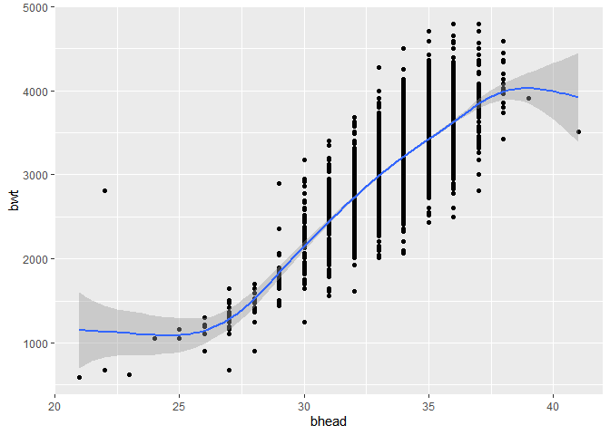<!-- -->

``` r
#Remove outlier
birthweight = birthweight %>% filter(!(bwt == 2807 & bhead == 22))
#Check linearity again
ggplot(data=birthweight, aes(x=bhead, y=bwt)) + geom_point() + geom_smooth()
```

    ## `geom_smooth()` using method = 'gam' and formula 'y ~ s(x, bs = "cs")'

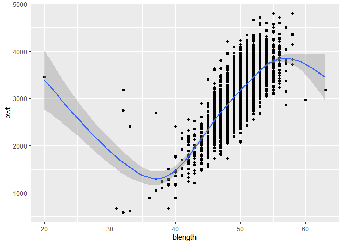<!-- -->

``` r
#blength
fit = lm(bwt ~ blength, data = birthweight)
summary(fit)
```

    ## 
    ## Call:
    ## lm(formula = bwt ~ blength, data = birthweight)
    ## 
    ## Residuals:
    ##     Min      1Q  Median      3Q     Max 
    ## -1796.9  -226.5    -5.7   221.3  4516.2 
    ## 
    ## Coefficients:
    ##             Estimate Std. Error t value Pr(>|t|)    
    ## (Intercept) -3861.48      95.17  -40.57   <2e-16 ***
    ## blength       140.21       1.91   73.41   <2e-16 ***
    ## ---
    ## Signif. codes:  0 '***' 0.001 '**' 0.01 '*' 0.05 '.' 0.1 ' ' 1
    ## 
    ## Residual standard error: 342.1 on 4339 degrees of freedom
    ## Multiple R-squared:  0.5539, Adjusted R-squared:  0.5538 
    ## F-statistic:  5388 on 1 and 4339 DF,  p-value: < 2.2e-16

``` r
#Check for linearity and outliers
ggplot(data=birthweight, aes(x=blength, y=bwt)) + geom_point() + geom_smooth()
```

    ## `geom_smooth()` using method = 'gam' and formula 'y ~ s(x, bs = "cs")'

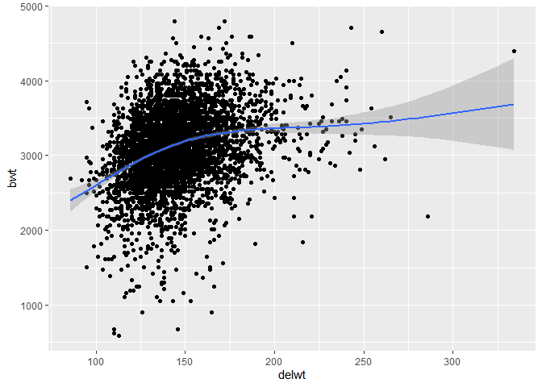<!-- -->

``` r
#Remove outlier
birthweight = birthweight %>% filter(!(bwt == 3459 & blength == 20))
#Check linearity again
ggplot(data=birthweight, aes(x=blength, y=bwt)) + geom_point() + geom_smooth()
```

    ## `geom_smooth()` using method = 'gam' and formula 'y ~ s(x, bs = "cs")'

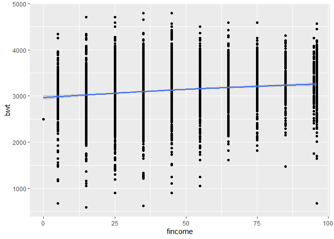<!-- -->

``` r
#delwt
fit = lm(bwt ~ delwt, data = birthweight)
summary(fit)
```

    ## 
    ## Call:
    ## lm(formula = bwt ~ delwt, data = birthweight)
    ## 
    ## Residuals:
    ##      Min       1Q   Median       3Q      Max 
    ## -2437.20  -286.10    21.99   316.75  1687.08 
    ## 
    ## Coefficients:
    ##              Estimate Std. Error t value Pr(>|t|)    
    ## (Intercept) 2148.2065    49.3898   43.49   <2e-16 ***
    ## delwt          6.6369     0.3354   19.79   <2e-16 ***
    ## ---
    ## Signif. codes:  0 '***' 0.001 '**' 0.01 '*' 0.05 '.' 0.1 ' ' 1
    ## 
    ## Residual standard error: 490.6 on 4338 degrees of freedom
    ## Multiple R-squared:  0.0828, Adjusted R-squared:  0.08259 
    ## F-statistic: 391.6 on 1 and 4338 DF,  p-value: < 2.2e-16

``` r
#Check for linearity and outliers
ggplot(data=birthweight, aes(x=delwt, y=bwt)) + geom_point() + geom_smooth()
```

    ## `geom_smooth()` using method = 'gam' and formula 'y ~ s(x, bs = "cs")'

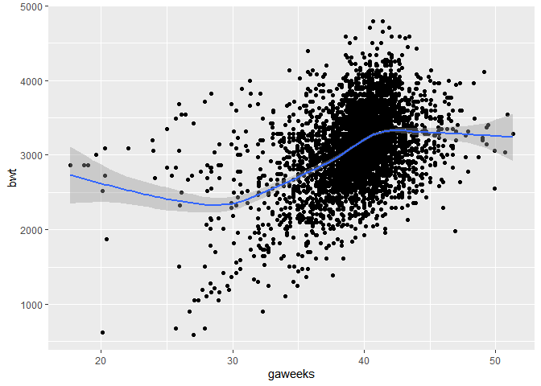<!-- -->

``` r
#Not linear, use categorical variable
birthweight = birthweight %>%
  mutate(delwt_cat = cut(delwt, c(85, 115, 135, 155, 335))) %>%
  mutate(delwt_cat = relevel(delwt_cat, "(135,155]"))
fit = lm(bwt ~ delwt_cat, data = birthweight)
summary(fit)
```

    ## 
    ## Call:
    ## lm(formula = bwt ~ delwt_cat, data = birthweight)
    ## 
    ## Residuals:
    ##      Min       1Q   Median       3Q      Max 
    ## -2464.91  -285.37    17.53   317.79  1646.09 
    ## 
    ## Coefficients:
    ##                    Estimate Std. Error t value Pr(>|t|)    
    ## (Intercept)         3144.91      11.96 262.874  < 2e-16 ***
    ## delwt_cat(85,115]   -440.77      34.26 -12.865  < 2e-16 ***
    ## delwt_cat(115,135]  -157.10      18.24  -8.611  < 2e-16 ***
    ## delwt_cat(155,335]   145.47      18.70   7.780 9.03e-15 ***
    ## ---
    ## Signif. codes:  0 '***' 0.001 '**' 0.01 '*' 0.05 '.' 0.1 ' ' 1
    ## 
    ## Residual standard error: 490.1 on 4336 degrees of freedom
    ## Multiple R-squared:  0.08528,    Adjusted R-squared:  0.08464 
    ## F-statistic: 134.7 on 3 and 4336 DF,  p-value: < 2.2e-16

``` r
#fincome
fit = lm(bwt ~ fincome, data = birthweight)
summary(fit)
```

    ## 
    ## Call:
    ## lm(formula = bwt ~ fincome, data = birthweight)
    ## 
    ## Residuals:
    ##      Min       1Q   Median       3Q      Max 
    ## -2592.58  -284.58     9.85   336.93  1704.39 
    ## 
    ## Coefficients:
    ##              Estimate Std. Error t value Pr(>|t|)    
    ## (Intercept) 2979.9075    15.1413  196.81   <2e-16 ***
    ## fincome        3.0486     0.2958   10.31   <2e-16 ***
    ## ---
    ## Signif. codes:  0 '***' 0.001 '**' 0.01 '*' 0.05 '.' 0.1 ' ' 1
    ## 
    ## Residual standard error: 506.1 on 4338 degrees of freedom
    ## Multiple R-squared:  0.02391,    Adjusted R-squared:  0.02368 
    ## F-statistic: 106.2 on 1 and 4338 DF,  p-value: < 2.2e-16

``` r
#Check for linearity and outliers
ggplot(data=birthweight, aes(x=fincome, y=bwt)) + geom_point() + geom_smooth()
```

    ## `geom_smooth()` using method = 'gam' and formula 'y ~ s(x, bs = "cs")'

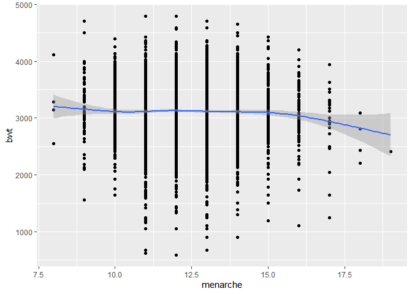<!-- -->

``` r
#frace
fit = lm(bwt ~ frace, data = birthweight)
summary(fit)
```

    ## 
    ## Call:
    ## lm(formula = bwt ~ frace, data = birthweight)
    ## 
    ## Residuals:
    ##      Min       1Q   Median       3Q      Max 
    ## -2437.64  -284.45    23.56   308.12  1754.12 
    ## 
    ## Coefficients:
    ##                   Estimate Std. Error t value Pr(>|t|)    
    ## (Intercept)        3265.44      10.63 307.296  < 2e-16 ***
    ## fraceAsian         -105.71      72.95  -1.449    0.147    
    ## fraceBlack         -313.56      15.44 -20.309  < 2e-16 ***
    ## fraceOther          -88.44     131.26  -0.674    0.500    
    ## fracePuerto Rican  -203.81      32.85  -6.204 6.01e-10 ***
    ## ---
    ## Signif. codes:  0 '***' 0.001 '**' 0.01 '*' 0.05 '.' 0.1 ' ' 1
    ## 
    ## Residual standard error: 489.5 on 4335 degrees of freedom
    ## Multiple R-squared:  0.08758,    Adjusted R-squared:  0.08673 
    ## F-statistic:   104 on 4 and 4335 DF,  p-value: < 2.2e-16

``` r
#gaweeks
fit = lm(bwt ~ gaweeks, data = birthweight)
summary(fit)
```

    ## 
    ## Call:
    ## lm(formula = bwt ~ gaweeks, data = birthweight)
    ## 
    ## Residuals:
    ##      Min       1Q   Median       3Q      Max 
    ## -1730.44  -292.52    -0.81   302.48  1591.36 
    ## 
    ## Coefficients:
    ##             Estimate Std. Error t value Pr(>|t|)    
    ## (Intercept)  475.674     88.818   5.356 8.97e-08 ***
    ## gaweeks       66.928      2.246  29.804  < 2e-16 ***
    ## ---
    ## Signif. codes:  0 '***' 0.001 '**' 0.01 '*' 0.05 '.' 0.1 ' ' 1
    ## 
    ## Residual standard error: 466.7 on 4338 degrees of freedom
    ## Multiple R-squared:   0.17,  Adjusted R-squared:  0.1698 
    ## F-statistic: 888.3 on 1 and 4338 DF,  p-value: < 2.2e-16

``` r
#Check for linearity and outliers
ggplot(data=birthweight, aes(x=gaweeks, y=bwt)) + geom_point() + geom_smooth()
```

    ## `geom_smooth()` using method = 'gam' and formula 'y ~ s(x, bs = "cs")'

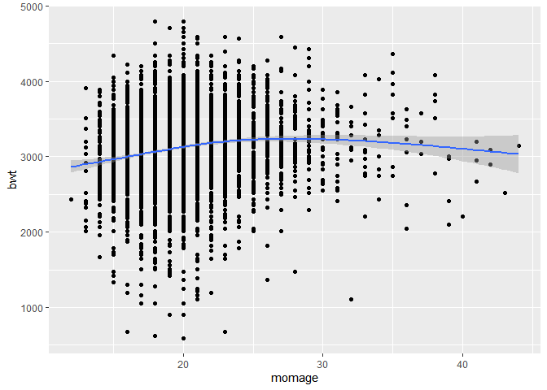<!-- -->

``` r
#Not linear, use categorical variable
birthweight = birthweight %>%
  mutate(gaweeks_cat = cut(gaweeks, c(17, 30, 35, 40, 52))) %>%
  mutate(gaweeks_cat = relevel(gaweeks_cat, "(35,40]"))
fit = lm(bwt ~ gaweeks_cat, data = birthweight)
summary(fit)
```

    ## 
    ## Call:
    ## lm(formula = bwt ~ gaweeks_cat, data = birthweight)
    ## 
    ## Residuals:
    ##      Min       1Q   Median       3Q      Max 
    ## -1730.03  -285.56    -0.89   309.44  1559.11 
    ## 
    ## Coefficients:
    ##                    Estimate Std. Error t value Pr(>|t|)    
    ## (Intercept)         3033.89      10.39  291.95   <2e-16 ***
    ## gaweeks_cat(17,30]  -708.86      55.01  -12.88   <2e-16 ***
    ## gaweeks_cat(30,35]  -444.83      31.65  -14.06   <2e-16 ***
    ## gaweeks_cat(40,52]   256.67      14.76   17.39   <2e-16 ***
    ## ---
    ## Signif. codes:  0 '***' 0.001 '**' 0.01 '*' 0.05 '.' 0.1 ' ' 1
    ## 
    ## Residual standard error: 467.9 on 4336 degrees of freedom
    ## Multiple R-squared:  0.1663, Adjusted R-squared:  0.1657 
    ## F-statistic: 288.3 on 3 and 4336 DF,  p-value: < 2.2e-16

``` r
#Categorical has lower adjusted R-squared, keep linear version

#malform
fit = lm(bwt ~ malform, data = birthweight)
summary(fit)
```

    ## 
    ## Call:
    ## lm(formula = bwt ~ malform, data = birthweight)
    ## 
    ## Residuals:
    ##      Min       1Q   Median       3Q      Max 
    ## -2519.36  -307.36    18.14   344.64  1676.64 
    ## 
    ## Coefficients:
    ##                Estimate Std. Error t value Pr(>|t|)    
    ## (Intercept)     3114.36       7.79 399.808   <2e-16 ***
    ## malformpresent    11.64     132.50   0.088     0.93    
    ## ---
    ## Signif. codes:  0 '***' 0.001 '**' 0.01 '*' 0.05 '.' 0.1 ' ' 1
    ## 
    ## Residual standard error: 512.3 on 4338 degrees of freedom
    ## Multiple R-squared:  1.781e-06,  Adjusted R-squared:  -0.0002287 
    ## F-statistic: 0.007724 on 1 and 4338 DF,  p-value: 0.93

``` r
#p > 0.25, don't include in multivariable model

#menarche
fit = lm(bwt ~ menarche, data = birthweight)
summary(fit)
```

    ## 
    ## Call:
    ## lm(formula = bwt ~ menarche, data = birthweight)
    ## 
    ## Residuals:
    ##      Min       1Q   Median       3Q      Max 
    ## -2523.72  -294.93    19.88   336.47  1672.28 
    ## 
    ## Coefficients:
    ##             Estimate Std. Error t value Pr(>|t|)    
    ## (Intercept) 3219.478     66.313  48.550   <2e-16 ***
    ## menarche      -8.397      5.262  -1.596    0.111    
    ## ---
    ## Signif. codes:  0 '***' 0.001 '**' 0.01 '*' 0.05 '.' 0.1 ' ' 1
    ## 
    ## Residual standard error: 512.1 on 4338 degrees of freedom
    ## Multiple R-squared:  0.0005866,  Adjusted R-squared:  0.0003562 
    ## F-statistic: 2.546 on 1 and 4338 DF,  p-value: 0.1106

``` r
#Check for linearity and outliers
ggplot(data=birthweight, aes(x=menarche, y=bwt)) + geom_point() + geom_smooth()
```

    ## `geom_smooth()` using method = 'gam' and formula 'y ~ s(x, bs = "cs")'

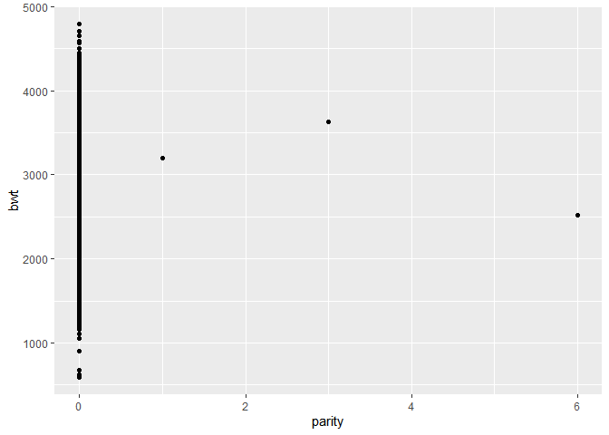<!-- -->

``` r
#Remove impossible observations
birthweight = birthweight %>% filter(!(menarche == 0 | menarche == 5))
#Check linearity again
ggplot(data=birthweight, aes(x=menarche, y=bwt)) + geom_point() + geom_smooth()
```

    ## `geom_smooth()` using method = 'gam' and formula 'y ~ s(x, bs = "cs")'

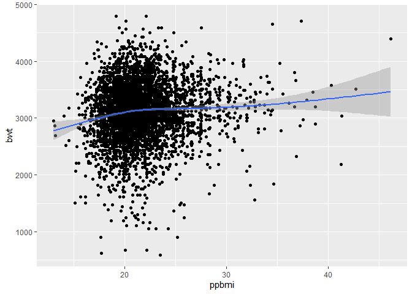<!-- -->

``` r
#momage
fit = lm(bwt ~ momage, data = birthweight)
summary(fit)
```

    ## 
    ## Call:
    ## lm(formula = bwt ~ momage, data = birthweight)
    ## 
    ## Residuals:
    ##      Min       1Q   Median       3Q      Max 
    ## -2514.20  -292.05    19.95   331.95  1717.49 
    ## 
    ## Coefficients:
    ##             Estimate Std. Error t value Pr(>|t|)    
    ## (Intercept) 2752.280     41.087  66.986   <2e-16 ***
    ## momage        17.846      1.988   8.977   <2e-16 ***
    ## ---
    ## Signif. codes:  0 '***' 0.001 '**' 0.01 '*' 0.05 '.' 0.1 ' ' 1
    ## 
    ## Residual standard error: 507.6 on 4336 degrees of freedom
    ## Multiple R-squared:  0.01825,    Adjusted R-squared:  0.01802 
    ## F-statistic: 80.59 on 1 and 4336 DF,  p-value: < 2.2e-16

``` r
#Check for linearity and outliers
ggplot(data=birthweight, aes(x=momage, y=bwt)) + geom_point() + geom_smooth()
```

    ## `geom_smooth()` using method = 'gam' and formula 'y ~ s(x, bs = "cs")'

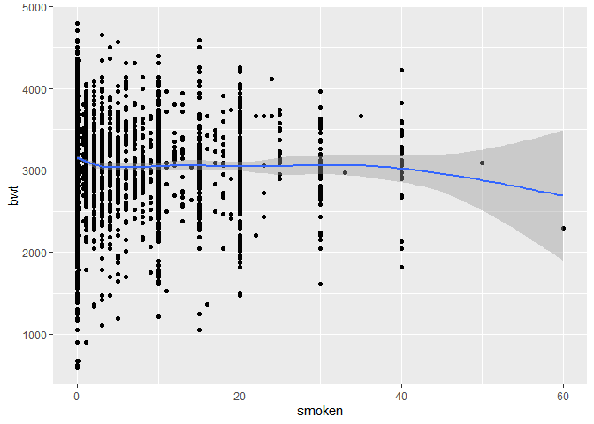<!-- -->

``` r
#Not linear, use categorical variable
birthweight = birthweight %>%
  mutate(momage_cat = cut(momage, c(11, 15, 20, 35, 45))) %>%
  mutate(momage_cat = relevel(momage_cat, "(15,20]"))
fit = lm(bwt ~ momage_cat, data = birthweight)
summary(fit)
```

    ## 
    ## Call:
    ## lm(formula = bwt ~ momage_cat, data = birthweight)
    ## 
    ## Residuals:
    ##      Min       1Q   Median       3Q      Max 
    ## -2516.36  -291.89    20.11   332.11  1721.11 
    ## 
    ## Coefficients:
    ##                   Estimate Std. Error t value Pr(>|t|)    
    ## (Intercept)        3069.89      10.70 286.894  < 2e-16 ***
    ## momage_cat(11,15]  -104.77      31.80  -3.295 0.000991 ***
    ## momage_cat(20,35]   126.47      16.10   7.854 5.03e-15 ***
    ## momage_cat(35,45]   -28.15      98.20  -0.287 0.774407    
    ## ---
    ## Signif. codes:  0 '***' 0.001 '**' 0.01 '*' 0.05 '.' 0.1 ' ' 1
    ## 
    ## Residual standard error: 507.2 on 4334 degrees of freedom
    ## Multiple R-squared:  0.02015,    Adjusted R-squared:  0.01947 
    ## F-statistic: 29.71 on 3 and 4334 DF,  p-value: < 2.2e-16

``` r
#mrace
fit = lm(bwt ~ mrace, data = birthweight)
summary(fit)
```

    ## 
    ## Call:
    ## lm(formula = bwt ~ mrace, data = birthweight)
    ## 
    ## Residuals:
    ##      Min       1Q   Median       3Q      Max 
    ## -2431.34  -285.44    22.43   309.56  1557.56 
    ## 
    ## Coefficients:
    ##                   Estimate Std. Error t value Pr(>|t|)    
    ## (Intercept)        3266.57      10.55 309.482  < 2e-16 ***
    ## mraceAsian         -126.34      75.31  -1.678   0.0935 .  
    ## mraceBlack         -316.13      15.39 -20.542  < 2e-16 ***
    ## mracePuerto Rican  -211.23      33.09  -6.383 1.92e-10 ***
    ## ---
    ## Signif. codes:  0 '***' 0.001 '**' 0.01 '*' 0.05 '.' 0.1 ' ' 1
    ## 
    ## Residual standard error: 489 on 4334 degrees of freedom
    ## Multiple R-squared:  0.08946,    Adjusted R-squared:  0.08883 
    ## F-statistic: 141.9 on 3 and 4334 DF,  p-value: < 2.2e-16

``` r
#parity
fit = lm(bwt ~ parity, data = birthweight)
summary(fit)
```

    ## 
    ## Call:
    ## lm(formula = bwt ~ parity, data = birthweight)
    ## 
    ## Residuals:
    ##      Min       1Q   Median       3Q      Max 
    ## -2519.69  -307.69    32.31   344.31  1676.31 
    ## 
    ## Coefficients:
    ##             Estimate Std. Error t value Pr(>|t|)    
    ## (Intercept)  3114.69       7.78 400.353   <2e-16 ***
    ## parity        -41.71      75.55  -0.552    0.581    
    ## ---
    ## Signif. codes:  0 '***' 0.001 '**' 0.01 '*' 0.05 '.' 0.1 ' ' 1
    ## 
    ## Residual standard error: 512.3 on 4336 degrees of freedom
    ## Multiple R-squared:  7.03e-05,   Adjusted R-squared:  -0.0001603 
    ## F-statistic: 0.3049 on 1 and 4336 DF,  p-value: 0.5809

``` r
#Check for linearity and outliers
ggplot(data=birthweight, aes(x=parity, y=bwt)) + geom_point() + geom_smooth()
```

    ## `geom_smooth()` using method = 'gam' and formula 'y ~ s(x, bs = "cs")'

    ## Warning: Computation failed in `stat_smooth()`:
    ## x has insufficient unique values to support 10 knots: reduce k.

<!-- -->

``` r
#p > 0.25, don't include in multivariable model

#pnumlbw
fit = lm(bwt ~ pnumlbw, data = birthweight)
summary(fit)
```

    ## 
    ## Call:
    ## lm(formula = bwt ~ pnumlbw, data = birthweight)
    ## 
    ## Residuals:
    ##      Min       1Q   Median       3Q      Max 
    ## -2519.59  -307.59    32.41   344.41  1676.41 
    ## 
    ## Coefficients: (1 not defined because of singularities)
    ##             Estimate Std. Error t value Pr(>|t|)    
    ## (Intercept) 3114.590      7.777   400.5   <2e-16 ***
    ## pnumlbw           NA         NA      NA       NA    
    ## ---
    ## Signif. codes:  0 '***' 0.001 '**' 0.01 '*' 0.05 '.' 0.1 ' ' 1
    ## 
    ## Residual standard error: 512.2 on 4337 degrees of freedom

``` r
#NA, all observations = 0

#pnumgsa
fit = lm(bwt ~ pnumsga, data = birthweight)
summary(fit)
```

    ## 
    ## Call:
    ## lm(formula = bwt ~ pnumsga, data = birthweight)
    ## 
    ## Residuals:
    ##      Min       1Q   Median       3Q      Max 
    ## -2519.59  -307.59    32.41   344.41  1676.41 
    ## 
    ## Coefficients: (1 not defined because of singularities)
    ##             Estimate Std. Error t value Pr(>|t|)    
    ## (Intercept) 3114.590      7.777   400.5   <2e-16 ***
    ## pnumsga           NA         NA      NA       NA    
    ## ---
    ## Signif. codes:  0 '***' 0.001 '**' 0.01 '*' 0.05 '.' 0.1 ' ' 1
    ## 
    ## Residual standard error: 512.2 on 4337 degrees of freedom

``` r
#NA, all observations = 0

#ppbmi
fit = lm(bwt ~ ppbmi, data = birthweight)
summary(fit)
```

    ## 
    ## Call:
    ## lm(formula = bwt ~ ppbmi, data = birthweight)
    ## 
    ## Residuals:
    ##     Min      1Q  Median      3Q     Max 
    ## -2548.3  -294.8    20.2   324.7  1712.5 
    ## 
    ## Coefficients:
    ##             Estimate Std. Error t value Pr(>|t|)    
    ## (Intercept) 2789.713     53.065  52.572  < 2e-16 ***
    ## ppbmi         15.061      2.434   6.189 6.63e-10 ***
    ## ---
    ## Signif. codes:  0 '***' 0.001 '**' 0.01 '*' 0.05 '.' 0.1 ' ' 1
    ## 
    ## Residual standard error: 510.1 on 4336 degrees of freedom
    ## Multiple R-squared:  0.008755,   Adjusted R-squared:  0.008527 
    ## F-statistic:  38.3 on 1 and 4336 DF,  p-value: 6.635e-10

``` r
#Check for linearity and outliers
ggplot(data=birthweight, aes(x=ppbmi, y=bwt)) + geom_point() + geom_smooth()
```

    ## `geom_smooth()` using method = 'gam' and formula 'y ~ s(x, bs = "cs")'

<!-- -->

``` r
#smoken
fit = lm(bwt ~ smoken, data = birthweight)
summary(fit)
```

    ## 
    ## Call:
    ## lm(formula = bwt ~ smoken, data = birthweight)
    ## 
    ## Residuals:
    ##      Min       1Q   Median       3Q      Max 
    ## -2541.29  -300.44    15.94   326.70  1654.71 
    ## 
    ## Coefficients:
    ##             Estimate Std. Error t value Pr(>|t|)    
    ## (Intercept) 3136.295      8.888   352.9  < 2e-16 ***
    ## smoken        -5.235      1.047    -5.0 5.95e-07 ***
    ## ---
    ## Signif. codes:  0 '***' 0.001 '**' 0.01 '*' 0.05 '.' 0.1 ' ' 1
    ## 
    ## Residual standard error: 510.8 on 4336 degrees of freedom
    ## Multiple R-squared:  0.005734,   Adjusted R-squared:  0.005504 
    ## F-statistic:    25 on 1 and 4336 DF,  p-value: 5.947e-07

``` r
#Check for linearity and outliers
ggplot(data=birthweight, aes(x=smoken, y=bwt)) + geom_point() + geom_smooth()
```

    ## `geom_smooth()` using method = 'gam' and formula 'y ~ s(x, bs = "cs")'

<!-- -->

``` r
#Not linear, use categorical variable
birthweight = birthweight %>%
  mutate(smoken_cat = cut(smoken, c(-1, 0, 40, 61)))
fit = lm(bwt ~ smoken_cat, data = birthweight)
summary(fit)
```

    ## 
    ## Call:
    ## lm(formula = bwt ~ smoken_cat, data = birthweight)
    ## 
    ## Residuals:
    ##      Min       1Q   Median       3Q      Max 
    ## -2566.15  -298.15    13.85   325.85  1629.85 
    ## 
    ## Coefficients:
    ##                   Estimate Std. Error t value Pr(>|t|)    
    ## (Intercept)        3161.15      10.09 313.385  < 2e-16 ***
    ## smoken_cat(0,40]   -112.50      15.71  -7.160 9.45e-13 ***
    ## smoken_cat(40,61]  -468.15     360.25  -1.299    0.194    
    ## ---
    ## Signif. codes:  0 '***' 0.001 '**' 0.01 '*' 0.05 '.' 0.1 ' ' 1
    ## 
    ## Residual standard error: 509.3 on 4335 degrees of freedom
    ## Multiple R-squared:  0.012,  Adjusted R-squared:  0.01154 
    ## F-statistic: 26.32 on 2 and 4335 DF,  p-value: 4.36e-12

#### Multivariable model building

I will exclude malform and parity from the model because their p-values
were \> 0.25 in the univariate analyses. pnumlbw and pnumsgsa had the
same value for all observations, so I’ll exclude them as well.

delwt, momage, and smoken were not linearly associated with birthweight,
so I created categorical versions to use instead.

I’ll start with all the remaining variables and remove them one at a
time based on their p-values until all p-values are \<
0.10.

``` r
fit = lm(bwt ~ babysex + bhead + blength + delwt_cat + fincome + frace + gaweeks + menarche + momage_cat + mrace + ppbmi + smoken_cat, data = birthweight)
summary(fit)
```

    ## 
    ## Call:
    ## lm(formula = bwt ~ babysex + bhead + blength + delwt_cat + fincome + 
    ##     frace + gaweeks + menarche + momage_cat + mrace + ppbmi + 
    ##     smoken_cat, data = birthweight)
    ## 
    ## Residuals:
    ##      Min       1Q   Median       3Q      Max 
    ## -1142.64  -183.77    -6.01   175.38  1481.51 
    ## 
    ## Coefficients:
    ##                      Estimate Std. Error t value Pr(>|t|)    
    ## (Intercept)        -5506.8751   115.4549 -47.697  < 2e-16 ***
    ## babysexmale          -32.3853     8.4086  -3.851 0.000119 ***
    ## bhead                131.7023     3.4769  37.879  < 2e-16 ***
    ## blength               80.4207     2.0595  39.048  < 2e-16 ***
    ## delwt_cat(85,115]   -104.6819    20.0401  -5.224 1.84e-07 ***
    ## delwt_cat(115,135]   -52.4021    10.4742  -5.003 5.87e-07 ***
    ## delwt_cat(155,335]    74.9297    11.6307   6.442 1.30e-10 ***
    ## fincome                0.2947     0.1785   1.651 0.098903 .  
    ## fraceAsian            29.1369    68.8059   0.423 0.671977    
    ## fraceBlack            30.9267    45.8372   0.675 0.499899    
    ## fraceOther             2.7408    73.6258   0.037 0.970306    
    ## fracePuerto Rican    -29.8725    44.3282  -0.674 0.500414    
    ## gaweeks               10.4843     1.4495   7.233 5.55e-13 ***
    ## menarche              -3.0753     2.9035  -1.059 0.289587    
    ## momage_cat(11,15]    -23.4931    17.4182  -1.349 0.177481    
    ## momage_cat(20,35]      9.9466     9.3854   1.060 0.289299    
    ## momage_cat(35,45]    -89.5794    53.0059  -1.690 0.091102 .  
    ## mraceAsian           -94.1999    71.4131  -1.319 0.187211    
    ## mraceBlack          -144.9274    45.7136  -3.170 0.001533 ** 
    ## mracePuerto Rican    -68.3150    44.7172  -1.528 0.126658    
    ## ppbmi                 -5.0658     1.6381  -3.092 0.001998 ** 
    ## smoken_cat(0,40]     -47.2694     8.5558  -5.525 3.49e-08 ***
    ## smoken_cat(40,61]    -13.6717   191.7266  -0.071 0.943156    
    ## ---
    ## Signif. codes:  0 '***' 0.001 '**' 0.01 '*' 0.05 '.' 0.1 ' ' 1
    ## 
    ## Residual standard error: 270.6 on 4315 degrees of freedom
    ## Multiple R-squared:  0.7224, Adjusted R-squared:  0.721 
    ## F-statistic: 510.3 on 22 and 4315 DF,  p-value: < 2.2e-16

``` r
#Remove frace
fit = lm(bwt ~ babysex + bhead + blength + delwt_cat + fincome + gaweeks + menarche + momage_cat + mrace + ppbmi + smoken_cat, data = birthweight)
summary(fit)
```

    ## 
    ## Call:
    ## lm(formula = bwt ~ babysex + bhead + blength + delwt_cat + fincome + 
    ##     gaweeks + menarche + momage_cat + mrace + ppbmi + smoken_cat, 
    ##     data = birthweight)
    ## 
    ## Residuals:
    ##      Min       1Q   Median       3Q      Max 
    ## -1142.29  -183.03    -6.05   175.02  1480.82 
    ## 
    ## Coefficients:
    ##                      Estimate Std. Error t value Pr(>|t|)    
    ## (Intercept)        -5503.5552   115.3738 -47.702  < 2e-16 ***
    ## babysexmale          -32.3289     8.4057  -3.846 0.000122 ***
    ## bhead                131.6738     3.4744  37.898  < 2e-16 ***
    ## blength               80.3749     2.0583  39.050  < 2e-16 ***
    ## delwt_cat(85,115]   -105.1788    20.0238  -5.253 1.57e-07 ***
    ## delwt_cat(115,135]   -52.5410    10.4668  -5.020 5.38e-07 ***
    ## delwt_cat(155,335]    75.2257    11.6225   6.472 1.07e-10 ***
    ## fincome                0.2921     0.1782   1.639 0.101300    
    ## gaweeks               10.4937     1.4490   7.242 5.20e-13 ***
    ## menarche              -3.0742     2.9003  -1.060 0.289235    
    ## momage_cat(11,15]    -23.1974    17.4083  -1.333 0.182750    
    ## momage_cat(20,35]      9.8611     9.3784   1.051 0.293104    
    ## momage_cat(35,45]    -89.8410    52.9860  -1.696 0.090041 .  
    ## mraceAsian           -69.6144    42.4049  -1.642 0.100734    
    ## mraceBlack          -114.7023     9.9672 -11.508  < 2e-16 ***
    ## mracePuerto Rican    -95.3558    18.9390  -5.035 4.98e-07 ***
    ## ppbmi                 -5.0773     1.6367  -3.102 0.001934 ** 
    ## smoken_cat(0,40]     -47.0747     8.5427  -5.511 3.79e-08 ***
    ## smoken_cat(40,61]    -13.7674   191.6699  -0.072 0.942742    
    ## ---
    ## Signif. codes:  0 '***' 0.001 '**' 0.01 '*' 0.05 '.' 0.1 ' ' 1
    ## 
    ## Residual standard error: 270.5 on 4319 degrees of freedom
    ## Multiple R-squared:  0.7223, Adjusted R-squared:  0.7211 
    ## F-statistic:   624 on 18 and 4319 DF,  p-value: < 2.2e-16

``` r
#Remove menarche
fit = lm(bwt ~ babysex + bhead + blength + delwt_cat + fincome + gaweeks + momage_cat + mrace + ppbmi + smoken_cat, data = birthweight)
summary(fit)
```

    ## 
    ## Call:
    ## lm(formula = bwt ~ babysex + bhead + blength + delwt_cat + fincome + 
    ##     gaweeks + momage_cat + mrace + ppbmi + smoken_cat, data = birthweight)
    ## 
    ## Residuals:
    ##      Min       1Q   Median       3Q      Max 
    ## -1144.47  -184.23    -6.08   176.08  1474.35 
    ## 
    ## Coefficients:
    ##                      Estimate Std. Error t value Pr(>|t|)    
    ## (Intercept)        -5545.7238   108.2989 -51.208  < 2e-16 ***
    ## babysexmale          -32.3022     8.4057  -3.843 0.000123 ***
    ## bhead                131.5735     3.4732  37.883  < 2e-16 ***
    ## blength               80.4385     2.0574  39.097  < 2e-16 ***
    ## delwt_cat(85,115]   -104.9056    20.0224  -5.239 1.69e-07 ***
    ## delwt_cat(115,135]   -52.5048    10.4669  -5.016 5.48e-07 ***
    ## delwt_cat(155,335]    75.5773    11.6179   6.505 8.64e-11 ***
    ## fincome                0.3007     0.1780   1.689 0.091225 .  
    ## gaweeks               10.5008     1.4490   7.247 5.02e-13 ***
    ## momage_cat(11,15]    -20.9741    17.2817  -1.214 0.224944    
    ## momage_cat(20,35]      8.7002     9.3144   0.934 0.350324    
    ## momage_cat(35,45]    -95.1476    52.7497  -1.804 0.071339 .  
    ## mraceAsian           -72.0398    42.3437  -1.701 0.088957 .  
    ## mraceBlack          -115.2121     9.9557 -11.572  < 2e-16 ***
    ## mracePuerto Rican    -95.6877    18.9367  -5.053 4.53e-07 ***
    ## ppbmi                 -4.9026     1.6285  -3.011 0.002623 ** 
    ## smoken_cat(0,40]     -47.1916     8.5421  -5.525 3.50e-08 ***
    ## smoken_cat(40,61]    -10.0442   191.6405  -0.052 0.958203    
    ## ---
    ## Signif. codes:  0 '***' 0.001 '**' 0.01 '*' 0.05 '.' 0.1 ' ' 1
    ## 
    ## Residual standard error: 270.5 on 4320 degrees of freedom
    ## Multiple R-squared:  0.7222, Adjusted R-squared:  0.7211 
    ## F-statistic: 660.6 on 17 and 4320 DF,  p-value: < 2.2e-16

``` r
#Collapse smoken categories
birthweight = birthweight %>%
  mutate(smoken_cat = cut(smoken, c(-1, 0, 61)))
fit = lm(bwt ~ babysex + bhead + blength + delwt_cat + fincome + gaweeks + momage_cat + mrace + ppbmi + smoken_cat, data = birthweight)
summary(fit)
```

    ## 
    ## Call:
    ## lm(formula = bwt ~ babysex + bhead + blength + delwt_cat + fincome + 
    ##     gaweeks + momage_cat + mrace + ppbmi + smoken_cat, data = birthweight)
    ## 
    ## Residuals:
    ##     Min      1Q  Median      3Q     Max 
    ## -1144.4  -184.2    -6.1   176.1  1474.3 
    ## 
    ## Coefficients:
    ##                     Estimate Std. Error t value Pr(>|t|)    
    ## (Intercept)        -5545.228    108.257 -51.223  < 2e-16 ***
    ## babysexmale          -32.331      8.403  -3.847 0.000121 ***
    ## bhead                131.560      3.472  37.891  < 2e-16 ***
    ## blength               80.436      2.057  39.101  < 2e-16 ***
    ## delwt_cat(85,115]   -104.934     20.020  -5.242 1.67e-07 ***
    ## delwt_cat(115,135]   -52.499     10.466  -5.016 5.48e-07 ***
    ## delwt_cat(155,335]    75.565     11.616   6.505 8.66e-11 ***
    ## fincome                0.301      0.178   1.691 0.090948 .  
    ## gaweeks               10.504      1.449   7.251 4.89e-13 ***
    ## momage_cat(11,15]    -20.961     17.280  -1.213 0.225184    
    ## momage_cat(20,35]      8.738      9.311   0.938 0.348078    
    ## momage_cat(35,45]    -95.138     52.744  -1.804 0.071335 .  
    ## mraceAsian           -72.072     42.339  -1.702 0.088779 .  
    ## mraceBlack          -115.236      9.954 -11.577  < 2e-16 ***
    ## mracePuerto Rican    -95.708     18.934  -5.055 4.49e-07 ***
    ## ppbmi                 -4.903      1.628  -3.011 0.002616 ** 
    ## smoken_cat(0,61]     -47.155      8.539  -5.522 3.54e-08 ***
    ## ---
    ## Signif. codes:  0 '***' 0.001 '**' 0.01 '*' 0.05 '.' 0.1 ' ' 1
    ## 
    ## Residual standard error: 270.5 on 4321 degrees of freedom
    ## Multiple R-squared:  0.7222, Adjusted R-squared:  0.7212 
    ## F-statistic: 702.1 on 16 and 4321 DF,  p-value: < 2.2e-16

``` r
#Collapse momage categories
birthweight = birthweight %>%
  mutate(momage_cat = cut(momage, c(11, 15, 35, 45))) %>%
  mutate(momage_cat = relevel(momage_cat, "(15,35]"))
fit = lm(bwt ~ babysex + bhead + blength + delwt_cat + fincome + gaweeks + momage_cat + mrace + ppbmi + smoken_cat, data = birthweight)
summary(fit)
```

    ## 
    ## Call:
    ## lm(formula = bwt ~ babysex + bhead + blength + delwt_cat + fincome + 
    ##     gaweeks + momage_cat + mrace + ppbmi + smoken_cat, data = birthweight)
    ## 
    ## Residuals:
    ##      Min       1Q   Median       3Q      Max 
    ## -1148.21  -183.07    -6.39   176.39  1472.42 
    ## 
    ## Coefficients:
    ##                      Estimate Std. Error t value Pr(>|t|)    
    ## (Intercept)        -5545.0262   108.2549 -51.222  < 2e-16 ***
    ## babysexmale          -32.2571     8.4030  -3.839 0.000125 ***
    ## bhead                131.5562     3.4720  37.890  < 2e-16 ***
    ## blength               80.4186     2.0570  39.094  < 2e-16 ***
    ## delwt_cat(85,115]   -105.1118    20.0185  -5.251 1.59e-07 ***
    ## delwt_cat(115,135]   -52.4966    10.4655  -5.016 5.48e-07 ***
    ## delwt_cat(155,335]    75.4124    11.6152   6.493 9.39e-11 ***
    ## fincome                0.3377     0.1736   1.945 0.051852 .  
    ## gaweeks               10.5456     1.4480   7.283 3.87e-13 ***
    ## momage_cat(11,15]    -23.4067    17.0817  -1.370 0.170669    
    ## momage_cat(35,45]    -99.8628    52.5023  -1.902 0.057229 .  
    ## mraceAsian           -68.2734    42.1442  -1.620 0.105307    
    ## mraceBlack          -117.0493     9.7644 -11.987  < 2e-16 ***
    ## mracePuerto Rican    -97.1086    18.8751  -5.145 2.80e-07 ***
    ## ppbmi                 -4.7929     1.6240  -2.951 0.003181 ** 
    ## smoken_cat(0,61]     -47.7685     8.5138  -5.611 2.14e-08 ***
    ## ---
    ## Signif. codes:  0 '***' 0.001 '**' 0.01 '*' 0.05 '.' 0.1 ' ' 1
    ## 
    ## Residual standard error: 270.5 on 4322 degrees of freedom
    ## Multiple R-squared:  0.7221, Adjusted R-squared:  0.7212 
    ## F-statistic: 748.8 on 15 and 4322 DF,  p-value: < 2.2e-16

All remaining continuous variables have p-values \< 0.10 and all
remaining categorical variables have at least one category with p \<
0.10.

The final model includes baby’s sex, baby’s head circumference, baby’s
length, mother’s delivery weight (categorical), family income,
gestational age, mother’s age (categorical), mother’s race, mother’s
pre-pregnancy BMI, and average number of cigarettes smoked per day
(categorical).

#### Plot predictions and residuals

``` r
birthweight = birthweight %>%
                add_residuals(fit) %>%
                add_predictions(fit)

ggplot(data=birthweight, aes(x=pred, y=resid)) + geom_point()
```

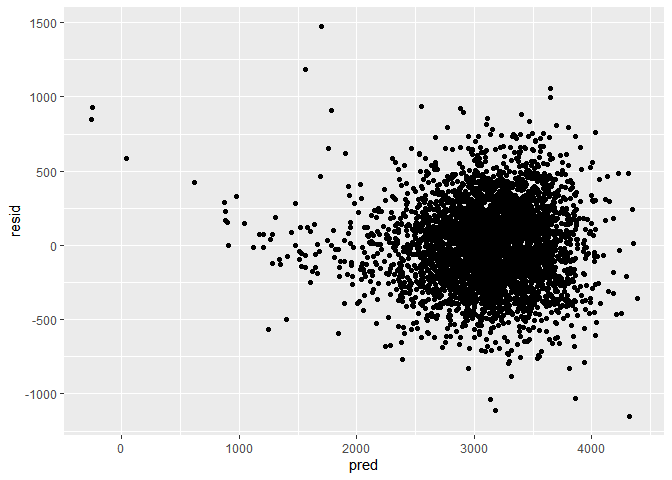<!-- -->

## Compare to other models

``` r
my_model = lm(bwt ~ babysex + bhead + blength + delwt_cat + fincome + gaweeks + momage_cat + mrace + ppbmi + smoken_cat, data = birthweight)

model2 = lm(bwt ~ blength + gaweeks, data=birthweight)

model3 = lm(bwt ~ bhead + blength + babysex + bhead*blength + bhead*babysex + blength*babysex + bhead*blength*babysex, data=birthweight)

cv_df =
  crossv_mc(birthweight, 100) %>% 
  mutate(
    train = map(train, as_tibble),
    test = map(test, as_tibble))

cv_df = 
  cv_df %>% 
  mutate(my_mod  = map(train, ~my_model),
         mod2     = map(train, ~model2),
         mod3  = map(train, ~model3)) %>% 
  mutate(rmse_my_mod = map2_dbl(my_mod, test, ~rmse(model = .x, data = .y)),
         rmse_mod2    = map2_dbl(mod2, test, ~rmse(model = .x, data = .y)),
         rmse_mod3 = map2_dbl(mod3, test, ~rmse(model = .x, data = .y)))

cv_df %>% 
  select(starts_with("rmse")) %>% 
  pivot_longer(
    everything(),
    names_to = "model", 
    values_to = "rmse",
    names_prefix = "rmse_") %>% 
  mutate(model = fct_inorder(model)) %>% 
  ggplot(aes(x = model, y = rmse)) + geom_violin()
```

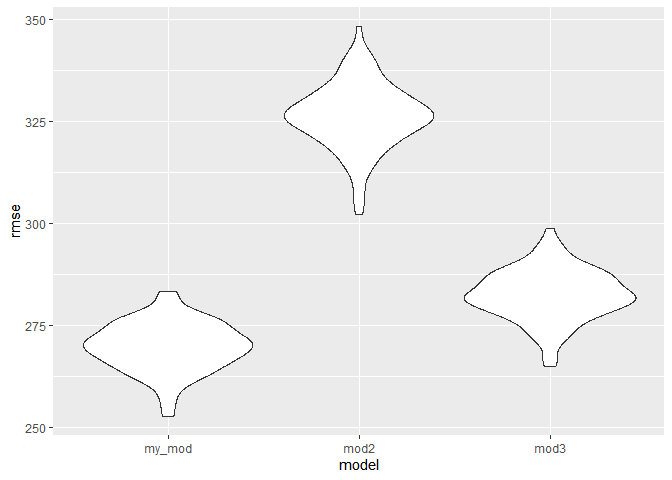<!-- -->

My model is the most accurate. The third model including head
circumerence, length, sex, and the interactions between them is close,
while the second model containing only length and gestational age is
much worse.

# Problem 2

## Load data

``` r
weather_df = 
  rnoaa::meteo_pull_monitors(
    c("USW00094728"),
    var = c("PRCP", "TMIN", "TMAX"), 
    date_min = "2017-01-01",
    date_max = "2017-12-31") %>%
  mutate(
    name = recode(id, USW00094728 = "CentralPark_NY"),
    tmin = tmin / 10,
    tmax = tmax / 10) %>%
  select(name, id, everything())
```

    ## Registered S3 method overwritten by 'crul':
    ##   method                 from
    ##   as.character.form_file httr

    ## Registered S3 method overwritten by 'hoardr':
    ##   method           from
    ##   print.cache_info httr

    ## file path:          C:\Users\Madeline\AppData\Local\rnoaa\rnoaa\Cache/ghcnd/USW00094728.dly

    ## file last updated:  2019-09-26 10:31:31

    ## file min/max dates: 1869-01-01 / 2019-09-30

## Generate 5000 bootstrapped samples

``` r
samples = weather_df %>% modelr::bootstrap(n = 5000)

boot_straps_tidy =
  samples %>% 
  mutate(
    models = map(strap, ~ lm(tmax ~ tmin, data = .x)),
    results = map(models, broom::tidy)) %>% 
  select(results) %>% 
  unnest(results) %>%
  select(term, estimate)

boot_straps_broom =
  samples %>% 
  mutate(
    models = map(strap, ~ lm(tmax ~ tmin, data = .x)),
    results = map(models, broom::glance)) %>% 
  select(results) %>% 
  unnest(results) %>%
  select(r.squared)

for (i in 1:10000) {
  boot_straps_tidy[i, "sample_id"] = ceiling(i/2)
}

boot_straps_tidy = pivot_wider(boot_straps_tidy,
                               names_from = "term",
                               values_from = "estimate")

for (i in 1:5000) {
  boot_straps_broom[i, "sample_id"] = i
}

boot_straps = inner_join(boot_straps_broom, boot_straps_tidy, by = "sample_id")

for (i in 1:5000) {
  boot_straps[i, "b0"] = boot_straps[i, "(Intercept)"]
}

boot_straps = boot_straps %>%
  mutate(log_b0_b1 = log(b0 * tmin)) %>%
  select(sample_id, log_b0_b1, r.squared)
```

## Plot distribution of estimates

#### Density of log(B0\*B1)

``` r
ggplot(boot_straps, aes(x = log_b0_b1)) + geom_density() + xlab("log(B0*B1)")
```

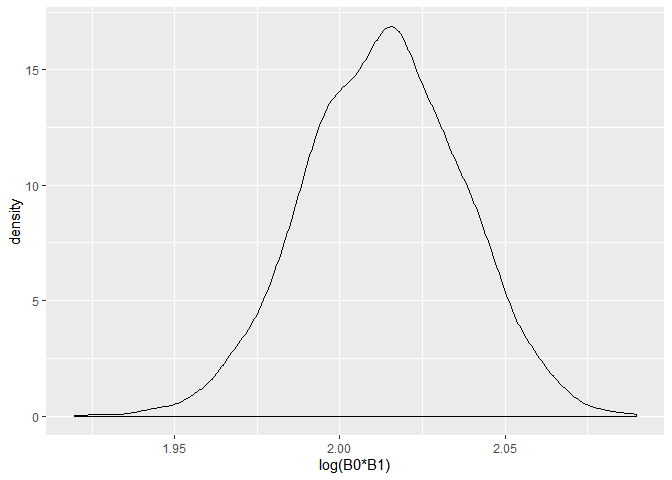<!-- -->

log(B0\*B1) is normally distriubted, with a mean of about
2.02.

#### Density of r squared

``` r
ggplot(boot_straps, aes(x = r.squared)) + geom_density() + xlab("r squared")
```

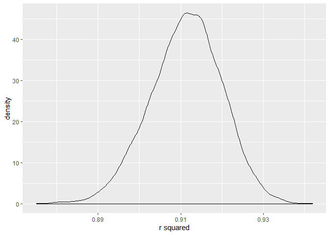<!-- -->

R squared is slightly left-skewed, with a mean of about 0.91.

## 95% Confidence Intervals

``` r
quantile(pull(boot_straps, log_b0_b1), probs=c(0.025, 0.975))
```

    ##     2.5%    97.5% 
    ## 1.966473 2.058794

``` r
quantile(pull(boot_straps, r.squared), probs=c(0.025, 0.975))
```

    ##      2.5%     97.5% 
    ## 0.8935629 0.9274586

The 95% confidence interval for log(B0\*B1) is (1.96, 2.06). The 95%
confidence interval for r squared is (0.89, 0.93).
